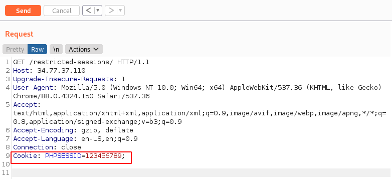
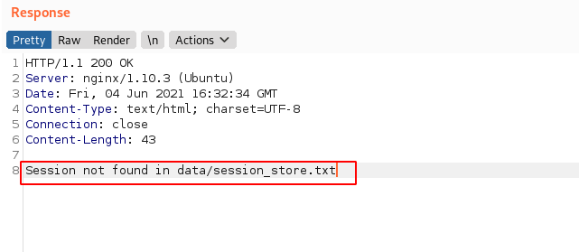
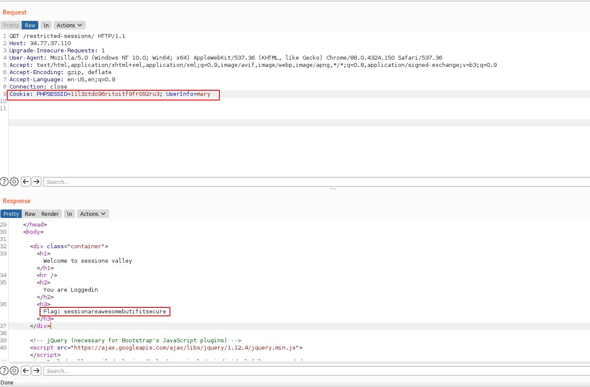

# CYBERTALENTS WRITEUPS
- Below is the wirteups of the web challenges done through my learning session.

# Challenge Name : Greeks

Category : General Information (50pts)

Challenge Description : The art of hiding messages or information inside other image / text or data

> Answer : steganography

-------------------------------------------------------------------------------------------------------------

# Challenge Name : The Restricted Sessions

Category : Web Security

Challenge Description : Flag is restricted to logged users only, can you be one of them?

Link : [http://34.77.37.110/restricted-sessions/](http://34.77.37.110/restricted-sessions/)

## Solution

The website is empty with a message.

You have to be logged in so as to be able to view the flag.

Though there is some interesting javascript available when we look at the source code: 

The javascript makes a post request to `getcurrentuserinfo.php` to exchange PHPSESSID cookie value with user info which is checked for login.

Trying to find the type of cookie or a clue around the cookie, we enter an invalid cookie ie `Cookie: PHPSESSID=123456789;`

this gives us the source of the php session id being stored under `data/session_store.txt`

We can use the link [http://34.77.37.110/restricted-sessions/data/session_store.txt](http://34.77.37.110/restricted-sessions/data/session_store.txt) that gives us 3 php sessions:
  - iuqwhe23eh23kej2hd2u3h2k23
  - 11l3ztdo96ritoitf9fr092ru3
  - ksjdlaskjd23ljd2lkjdkasdlk
  
We still can't get access since a `UserInfo` is required. This gives us the flag finally.

> flag : sessionareawesomebutifitsecure

--------------------------------------------------------------------------------------------------------------

# 
