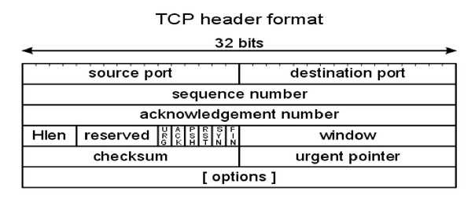

# Scanning

> Network Scanning is a method of getting network information such as identification of hosts, port information, and services by scanning networks and ports.

**Main objectives of scanning**
   1. Learn more about targets and find openings by interacting with the target environment.
   2. Determine network addresses of live hosts, firewalls, routers, etc on the network.
   3. Determine the network topology of the target environment.
   4. Determine the OS types of discovered hosts.
   5. Determine open ports and network services in a target environment.
   6. Determine lists of potential vulnerabilities. Do this in a manner that minimizes risk of impairing host or services.
   
### TCP/IP Basics
The design and operation of the Internet is based on the Internet Protocol Suite, commonly also called **TCP/IP**.

Network services are referenced using two components: a `host address` and a `port number`.

There are 65535 distinct and usable port numbers.(Port 0 is not a usable port number).

Some port scanners scan only the most common port numbers or ports most associated with vulnerable services on a given host.

Result of a scan on a port is generalized into three categories:
   1. `Open or Accepted` : The host sent a reply indicating that a service is listening on the port.
   2. `Closed or Denied or Not Listening` : The host sent a reply indicating that connections will be denied to the port.
   3. `Filtered, Dropped or Blocked` : There was no reply from the host.
   
Open ports present two vulnerabilities:
   1. Security and stability concerns associated with the **program** responsible for delivering the service.
   2. Security and stability concerns associated with the **operating system** that is running on the host.
   
Filtered ports do not tend to present vulnerabilities.

### TCP
> TCP : Connection-oriented; tries to preserve sequence; retransmits lost packets.

###### TCP Flags:
   1. **SYN** Initializes a connection between two hosts to facilitate communication.
   2. **ACK** Acknowledge the receipt of a packet.
   3. **URG** Indicates that the data contained in the packet is urgent and should be processed immediately.
   4. **PSH** Instructs the sending system to send all buffered data immediately.
   5. **FIN** Tells the remote system about the end of the communication. Closes a connection.
   6. **RST** Reset a connection.

###### TCP Three-way Handshake
Every legit TCP connection starts with three-way handshake.

Used to exchange sequence numbers that will be applied in increasing fashion for all follow-on packets for that connection.

###### Scanning TCP ports: 
If something is listening on a TCP port and a SYN arrives on that port, the system responds with a SYN-ACK regardless of the payload of the SYN packet. giving a reliable indication of which ports are listening.

| **HOST A** |         | **HOST B** |
| -----------|----------|---------- |
| Send SYN seq=x | &#8594; | Receive SYN |
| Receive SYN + ACK | &#8592; | Send SYN seq=y, ACKx+1 |
| Send ACK y+1 | &#8594; | Receive ACK |

### UDP
> UDP : Connectionless; no attempt made for reliable delivery.

###### Scanning UDP ports:
   1. There is no connection with UDP.
   2. Less options for scanning.
   3. Often slower scanning.
   4. Less reliable scanning.

### Scanning Types.

