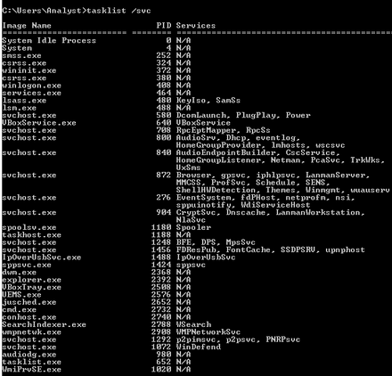
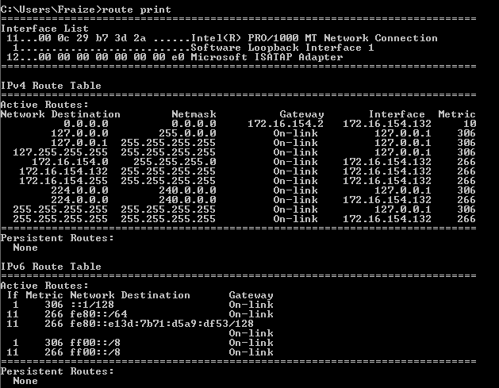
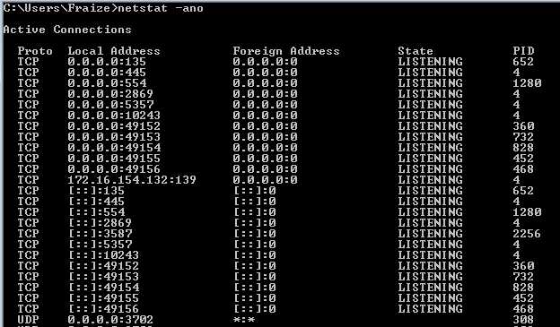

# Privilege Escalation
> Is the act of exploiting a bug, design flaw or configuration oversight in an operating system or software application to gain elevated acces to resources that are normally protected from an application or user.

### Types of privilege escalation.
1. **Horizontal privilege escalation**

It requires the attacker to gain access to the account credentials as well as expanding their privileges.

The attacker has a few options to choose from, ie,
  1. to exploit vulnerabilities in the OS to gain system or root-level access.
  2. to use hacking tools like Metasploit to make the job abit easier.
  
2. **Vertical privilege escalation**

Gain access with existing account which has been compromised with the intent to perform actions as that person. Such include phishing emails that may ask to click the link and login to their account.

### Gathering information process
Using the Horizontal privilege escalation process, enumerate some information about the OS, users, applications running among so much more.

###### Enumerating Users
 - **Windows** net user
 - **Linux** cat /etc/passwd

Identify the current user
 - **Windows** net user
 - **Linux** id
 
###### Gathering OS information

By gathering information about the OS you're dealing with, some vulnerabilities can be exploited if the version of the said OS is outdated, or could be a zero-day exploit you come up with.

### Gathering Process information

This displays a list of the current running processes on the local computer or on a remote computer hence can help exploit weak configured services or applications with current user account privileges.

### Network information

This information can give an advantage of open ports and the protocols that are currently running on the system.

One of the popular vulnerability & exploit database that could help when searching for exploits is : [https://www.rapid7.com/db/](https://www.rapid7.com/db/)

### Automatic privilege escalation
This is done by the use of scripts.

###### Linux automatic privilege escalation
- LinuEnum
- Linuxprivchecker
- Linux Exploit Suggester 2
- Bashark
- BeRoot

###### Windows automatic privilege escalation
- Windows-Exploit-Suggester
- Windows Gather Applied Patches
- Sherlock
- JAWS - Just Another Windows(Enum) script
- PowerUp

Other several scripts are used in pentesting to quickly identify potential privilege escalation vectors.

Useful commands that can be used on both Linux and windows are:
| **Purpose of Command** | **Linux** | **Windows** |
| ---------------------- | --------- | ----------- |
| Name of current user | whoami | whoami |
| Operating system | uname -a | ver |
| Network configuration | ifconfig | ipconfig /all |
| Network connections | netstat -an | netstat -an |
| Running processes | ps -ef | tasklist |

----------------------------------------------------------------------------------
# Writeups

#### Challenge 1

###### Challenge Name : **Shadower**

Challenge Category : Machines

Challenge Level : Medium

Challenge Description : Get The highest privilege on the machine and find the flag!

Target IP: 35.156.4.248

**solution**

> flag

#### Challenge 2

###### Challenge Name : **Injector**

Challenge Category : Machines

Challenge Level : Medium

Challenge Description : Get The highest privilege on the machine and find the flag!

Target IP: 52.57.53.227

Target IP: 18.193.68.184
